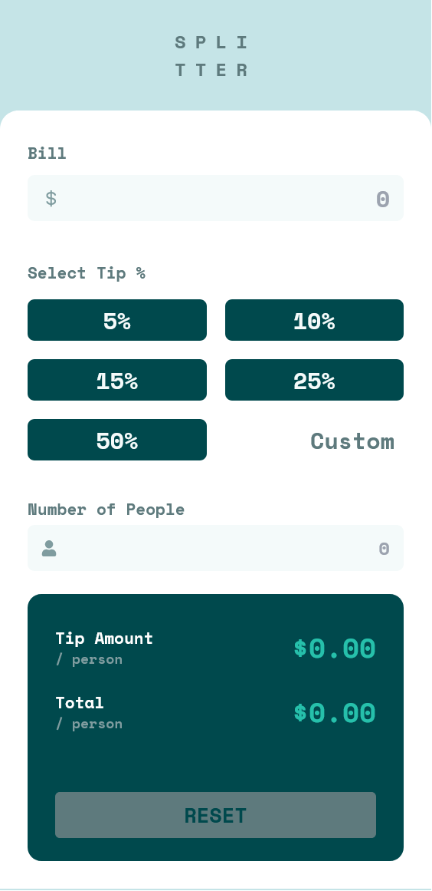

# Frontend Mentor - Tip calculator app solution

## Table of contents

- [Overview](#overview)
  - [The challenge](#the-challenge)
  - [Screenshot](#screenshot)
  - [Links](#links)
- [My process](#my-process)
  - [Built with](#built-with)
  - [What I learned](#what-i-learned)
  - [Continued development](#continued-development)
  - [Useful resources](#useful-resources)
- [Author](#author)
- [Acknowledgments](#acknowledgments)

## Overview

### The challenge

Users should be able to:

- View the optimal layout for the app depending on their device's screen size
- See hover states for all interactive elements on the page
- Calculate the correct tip and total cost of the bill per person

### Screenshot

### Links

- Solution URL: (https://tip-calculator-drew.netlify.app/)
- Live Site URL: (https://github.com/drew-chidi/tip-calculator/)

## My process

### Built with

- Semantic HTML5 markup
- CSS custom properties
- Flexbox
- CSS Grid
- Mobile-first workflow
- [React](https://reactjs.org/) - JS library
- [Tailwind CSS](https://tailwindcss.com/) - For styles

### What I learned

I learned a few things about customizing tailwind and using CSS Variables in tailwind.

### Continued development

I want to learn more about React Lifecycles and how states are rendered

## Author

- Website - [Andrew Chidi]

## Acknowledgments

With the help of some friends. I was able to debug why I had to click a couple of times before my button carryout the necessary action. Big shoutout to Yomi, Zeek and Opeoluwa for explaining lifecycle to me.
